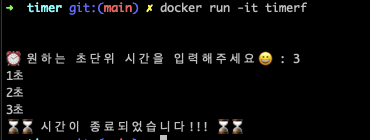

# 도커 이미지로 ⏰타이머를 실행해보기

---

### 1. 호스트 환경에서 현재 디렉토리에 Dockerfile이 있는지 확인하기

```ls```

### 2. 도커파일을 이미지로 빌드하기

```docker build -t fancytimer .```

### 3. 이미지를 실행시킬 때, 쉘 환경과 상호 작용하기 위해 -it를 붙이기

```docker run -it fancytimer```

### 4. 초 단위 시간을 입력하면 ⏰ 타이머가 작동되고 컨테이너를 종료합니다


